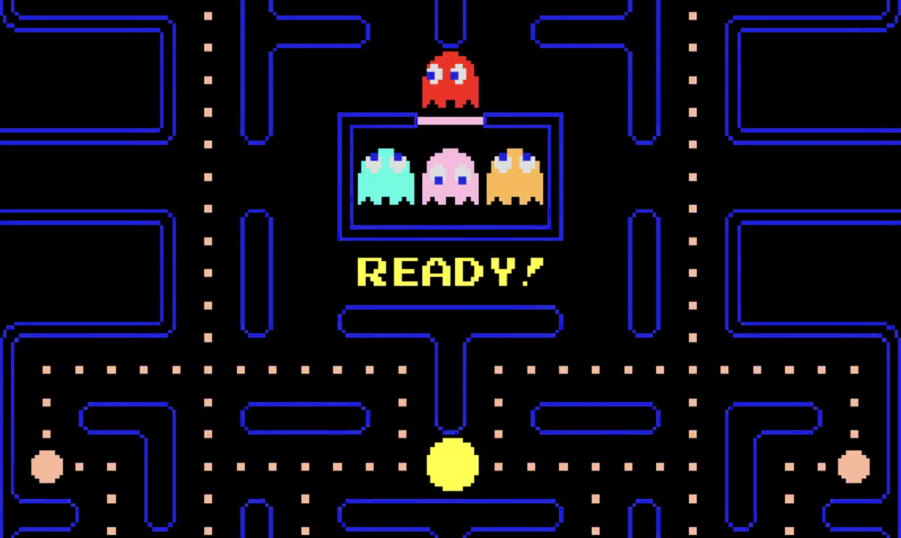

# Pacman Game
## CS110 Final Project Fall, 2024

## Team Members

Hyeon-Jun Cha

***

## Project Description

A Pacman-inspired game where the player collects pellets, avoids ghosts, and navigates through a maze.

***

## GUI Design

### Initial Design

### Final Design

## Program Design

### Features

1. Player movement: up, down, left, and right.
2. Pellet collection for scoring.
3. Static maze layout with walls and paths.
4. Victory condition: collect all pellets.
5. Ghosts with basic AI movement that cause a game-over upon collision.
6. Game-over condition: collision with a ghost.

### Classes

- **Player**: Handles the player's movement, collision with walls, and pellet collection.
- **Ghost**: Represents enemies with simple AI movement.
- **Wall**: Represents the maze's static walls that block movement.
- **Pellet**: Collectible objects that contribute to the score.
- **Controller**: Manages the game loop, input handling, and overall game logic.
- **View**: Handles the rendering of all visual elements, including the maze, player, ghosts, and pellets.
- **Settings**: Stores global constants such as screen dimensions, colors, and tile size.

## ATP

| Step | Procedure                          | Expected Results                                     |
|------|------------------------------------|-----------------------------------------------------|
| 1    | Run the Pacman Game program        | The GUI window appears, showing the maze, player, pellets, and ghosts. |
| 2    | Move the player using arrow keys   | The player moves in the selected direction.         |
| 3    | Collide with a pellet              | The pellet disappears, and the score increases.     |
| 4    | Close the game window               | The game closes without errors.           |
| 5    | Collect all pellets                | The game ends with a "You Win!" message.            |
| 6    | Collide with the ghosts             | The game ends with a "Game Over"                    |
